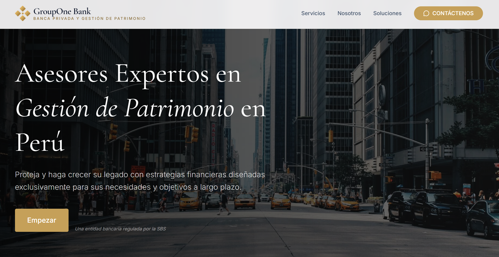

Landing page conceptual para **GroupOne Bank**, enfocada en **banca privada y gestión patrimonial** (GroupOne Private).
Incluye secciones informativas, CTA hacia WhatsApp y componentes UI para agendar consulta.
---

## Demo
- GitHub Pages: `https://franckvm.github.io/GroupOne-Bank/`

  

> Si cambias el nombre del repositorio, actualiza el `base` en `vite.config.ts`.

---

## Tecnologías
- **React** + **TypeScript**
- **Vite**
- **Tailwind CSS**
---

## Requisitos
- **Node.js** 18+ (recomendado 20)
- **npm** (o tu gestor de paquetes preferido)

---

## Instalación y ejecución (local)

```bash
# 1) Instalar dependencias
npm install

# 2) Levantar en modo desarrollo
npm run dev
